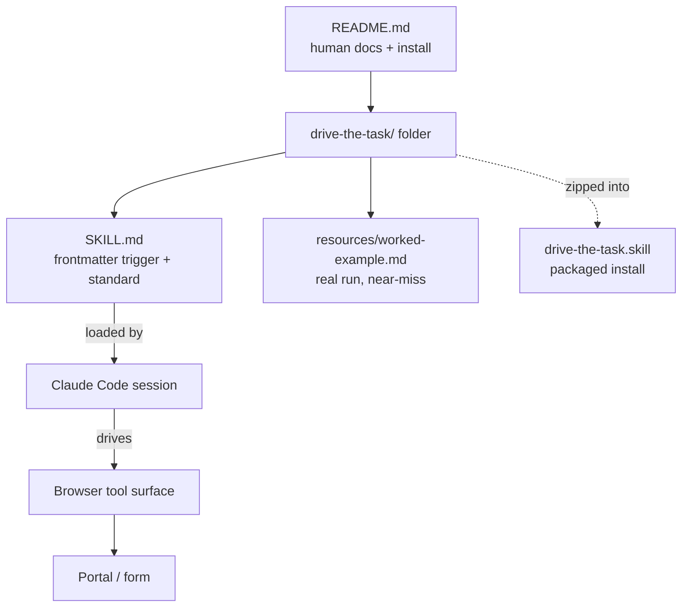

# System architecture

## Overview

This repository is a **Claude Code skill**, not an application. It contains no executable code. The "system" is a small set of Markdown files that Claude loads as instructions:

- `drive-the-task/SKILL.md` is the skill itself. Its YAML frontmatter `description` is the **trigger surface**: Claude Code matches it against the task to decide when to load the skill. The body is the standard: the loop, the gate table, wording rules, preparation, recovery, honesty and credential discipline.
- `drive-the-task/resources/worked-example.md` is supporting material that ships in the skill folder alongside `SKILL.md`. It is a sanitised account of a real multi-page state tax portal run, used to show the shape of a good run and the near-miss that the rules prevent.
- `drive-the-task.skill` is a zip package of the `drive-the-task/` folder, for clients that offer a "Save skill" install action.
- `README.md` is for people: why the skill exists, what it does, and three install methods.

## Module graph

## Constraints

- **Instructions only.** Behaviour comes from the wording of `SKILL.md`, so editing the prose is changing the product.
- **Skills load at session start.** After an install or update the user needs a fresh conversation (the README says so).
- **Two copies of the skill must stay in sync.** The folder and the `.skill` zip hold the same two files. They matched when this page was written, but the repo has no build script, so the zip has to be rebuilt by hand after every edit (inferred from the file list). See [[folder-plus-packaged-skill]].
- **Needs a browser-driving tool.** The recovery guidance names accessibility-tree tools (`find`, `read_page`). The skill assumes Claude has a browser it can operate but does not name one (inferred).
