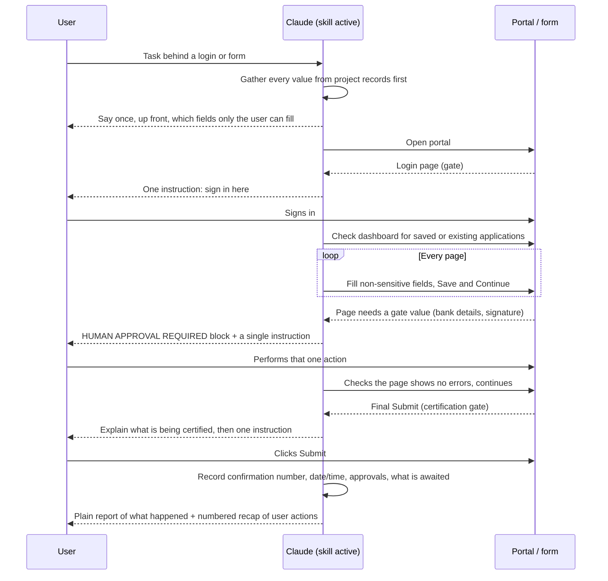

# Key flows

## End-to-end path of a typical request

A typical run is a portal application. Claude prepares, drives until the first gate, asks for one action, resumes, and records the outcome.

## Other important flows

- **Session timeout mid-flow.** Say plainly which pages saved and which did not, get the user signed back in, confirm that each completed page actually persisted, and refill whatever did not.
- **Field won't take a value.** Use the accessibility tree before clicking at coordinates. Custom dropdowns usually need the option clicked, not typed.
- **Page looks wrong.** Take a screenshot and read the page before acting. Never click Submit to "see what happens".
- **Install.** Copy the folder into a skills directory, clone then copy, or use the `.skill` package. Then start a new conversation and check that the skill appears under `/`. See [[folder-plus-packaged-skill]].
