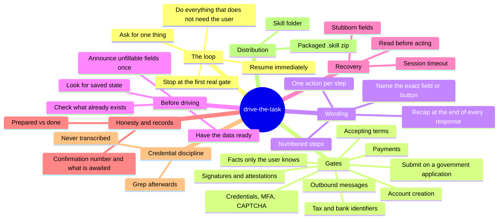

# Feature mindmap

## Feature mindmap

Pages behind the branches: [[checklist-is-the-fallback]], [[gate-taxonomy]], [[one-action-at-a-time]], [[prepared-is-not-done]], [[folder-plus-packaged-skill]].
