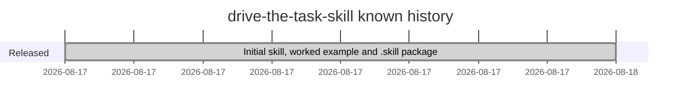

# Roadmap

## Milestones

The repository has a single commit, the initial publication of the skill (2026-08-17). No roadmap, planned versions or changelog are recorded in the repo.

## Open questions for the owner

- Are further versions planned, such as more worked examples or a changelog like the companion `agency-conduct` skill has? Nothing in the repo says so.
- Should a license be added before wider sharing? See the open items on the stack page.
- Should the `.skill` package be built automatically so it cannot drift from the folder? See [[folder-plus-packaged-skill]].
