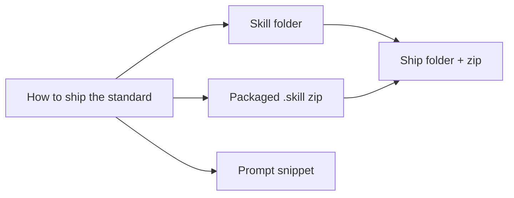

# Tech stack

## Technology choices

| domain | candidates | decision | rationale |
|---|---|---|---|
| Delivery format | Claude Code skill; prompt or CLAUDE.md snippet; code tool | Claude Code skill (`SKILL.md` with YAML frontmatter) | Loads automatically when the frontmatter description matches a task, and can also be invoked explicitly as `/drive-the-task` |
| Supporting material | Everything in `SKILL.md`; separate resource file | Worked example as `resources/worked-example.md` | Keeps the rules short while shipping a real run as a teaching example (inferred rationale) |
| Packaging | Folder only; zip only; both | Both: the folder plus `drive-the-task.skill` (zip) | The folder works in every client; the zip suits clients with a "Save skill" action. See [[folder-plus-packaged-skill]] |
| Runtime dependency | none named | A browser-driving tool available to Claude | The skill operates portals. It refers to accessibility-tree tools (`find`, `read_page`) without naming a specific browser (inferred) |
| Code | none | None | The product is the wording of the standard |

## Decision mindmap

## Open items

- **License.** The repository is public but has no LICENSE file, and the README states no license terms. Owner to decide whether to add one.
- **Zip rebuild.** The `.skill` package is committed alongside the folder with no build script. Whether a script or release step should generate it is undecided.
